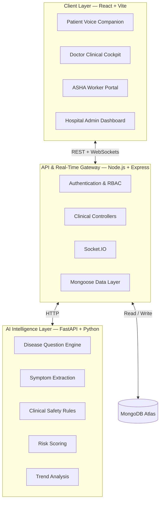

<div align="center">

# ❤️ CareWatch (Sanjeevni)

### AI-Powered Post-Discharge Monitoring & Care Coordination

**Detect concerning changes in a patient's condition relative to their personal baseline — before they become critical.**

[](frontend/)
[](backend/)
[](ai-service/)
[](https://www.mongodb.com/)
[](backend/src/sockets/)
[](LICENSE)

**[Problem](#the-problem) · [Solution](#the-carewatch-approach) · [Features](#key-features) · [Architecture](#architecture) · [Setup](#getting-started) · [Demo](#demo)**

</div>

---

## Overview

**CareWatch (Sanjeevni)** is a post-discharge monitoring and care-coordination platform designed for rural, semi-urban, and low-literacy communities.

Instead of waiting for the next hospital visit, CareWatch creates a **personal discharge baseline**, collects lightweight voice or text check-ins, analyzes changes over time, and routes concerning cases to the appropriate level of human attention.

The platform connects:

**Patient → AI monitoring → Community Health Worker → Doctor → Follow-up**

> ⚠️ **Clinical scope**
>
> CareWatch is an early-warning and care-coordination system, **not an AI doctor**. It does not independently diagnose diseases or prescribe medicines. Clinical decisions remain with qualified healthcare professionals.

---

## The Problem

After discharge, patients can enter a **post-discharge blind spot** where continuous clinical visibility decreases until the next follow-up appointment or an emergency visit.

Key challenges include:

- **Subtle deterioration** can occur between scheduled follow-ups.
- **Digital literacy barriers** can make conventional app-based questionnaires difficult.
- **Generic thresholds** may not reflect an individual patient's normal condition.
- **Limited healthcare resources** make it important to prioritize cases that need human attention.
- **Fragmented information** can make it difficult for clinicians to see the patient's progression from discharge to the current state.

---

## The CareWatch Approach

CareWatch focuses on **change over time**, rather than treating every patient with the same static threshold.

```text
Hospital Discharge
        │
        ▼
Personal Baseline
        │
        ▼
Voice / Text Check-in
        │
        ▼
Disease-Adaptive Questions
        │
        ▼
Symptoms + Measurements + Trends
        │
        ▼
AI-Assisted Risk Prioritization
        │
   ┌────┼─────────────┐
   ▼    ▼             ▼
 LOW  MEDIUM         HIGH
   │    │             │
   │    ▼             ▼
   │  Field         Doctor
   │ Verification   Review
   │    │             │
   └────┴──────┬──────┘
               ▼
       Clinical Decision
               │
               ▼
       Follow-up Monitoring
```

### Core idea

> **Monitor the patient's trajectory, identify concerning changes early, and connect the right case to the right level of care.**

---

## Why CareWatch?

| Capability | What it provides |
|---|---|
| 🗣️ **Voice-first interaction** | Spoken Hindi/English check-ins reduce dependence on reading and typing. |
| 📈 **Personalized monitoring** | Current observations can be compared with the patient's own discharge baseline and recent trajectory. |
| 🩺 **Disease-adaptive questions** | Monitoring questions can vary according to the patient's clinical context. |
| 🤝 **Human-in-the-loop** | Elevated-risk cases can be routed to a healthcare worker for physical verification. |
| 🔄 **Closed-loop workflow** | Alerts can lead to verification, clinical review, decisions, and continued monitoring. |
| 🏷️ **Data provenance** | Patient reports, field assessments, hospital data, and clinical decisions can remain distinguishable. |

---

# Key Features

## 🗣️ Voice-First Patient Check-ins

- Spoken interaction in Hindi and Indian English
- Browser-based speech recognition and synthesis
- Conversational **question → response → next question** flow
- Text fallback when voice is unavailable
- Disease-adaptive question protocols
- Designed to reduce dependence on typing and complex forms

## 📊 Personalized Risk Monitoring

- Patient-specific discharge baseline
- Baseline-to-current comparisons
- Longitudinal trend analysis
- Configured clinical safety rules
- Risk score and risk level
- Structured reasons supporting risk prioritization

## 🚨 Clinical Alerts

The doctor dashboard surfaces concerning patients with context rather than only an isolated risk number.

Alerts can include:

- Current risk level
- Baseline → current measurement changes
- Patient-reported symptoms
- Healthcare-worker verification
- Recommended action
- Alert state and history

## 👩‍⚕️ Healthcare-Worker Verification

When risk is elevated, an assigned ASHA/community health worker can perform an in-person assessment and record verified observations or vital measurements.

This creates an important distinction between:

**Patient-reported information** → **Field-verified information** → **Clinical decision**

## 🩺 Doctor Clinical Cockpit

Doctors can review:

- Prioritized patients
- Current and historical risk assessments
- Clinical alerts
- Baseline and current measurements
- Patient observations
- Healthcare-worker assessments
- Longitudinal timelines
- Previous actions and clinical decisions

## 📜 Longitudinal Patient Timeline

The patient record brings together:

**Hospital discharge → Check-ins → Measurements → AI assessments → Field verification → Doctor decision → Follow-up**

This helps clinicians understand **what changed, when it changed, and what action followed**.

---

# How It Works

### 1. Discharge & Baseline

The hospital records relevant discharge information such as diagnosis, medications, and available measurements.

This establishes the patient's reference point for subsequent monitoring.

### 2. Conversational Check-in

The patient starts a check-in and answers disease-targeted questions aloud in their preferred language.

### 3. AI-Assisted Analysis

The AI service:

- extracts structured observations,
- applies configured safety rules,
- compares available measurements with the patient's baseline,
- evaluates recent trends, and
- produces a risk-prioritization signal with supporting reasons.

### 4. Risk Prioritization

| Risk | Platform response |
|---|---|
| 🟢 **LOW** | Continue routine monitoring |
| 🟡 **MEDIUM** | Route for healthcare-worker verification where applicable |
| 🔴 **HIGH** | Surface an urgent clinical alert for doctor review |

> These levels are **prioritization states for the prototype workflow**, not a replacement for clinical judgment.

### 5. Human Verification

For elevated-risk cases, an assigned healthcare worker can perform a physical assessment and submit verified observations.

### 6. Doctor Review

The doctor reviews the available evidence and records the appropriate clinical decision.

```text
AI Signal
   ↓
Risk Prioritization
   ↓
Healthcare Worker Verification
   ↓
Doctor Review
   ↓
Clinical Decision
   ↓
Follow-up Monitoring
```

---

# Disease-Adaptive Check-in Protocols

CareWatch can organize monitoring around the patient's clinical context.

| Protocol | Example context | Areas assessed |
|---|---|---|
| 🫁 **Respiratory** | Pneumonia, COPD, asthma, bronchitis | Breathing difficulty, sputum, fever, SpO₂, medication adherence |
| 🫀 **Cardiac** | Heart failure, hypertension, post-MI | Swelling, orthopnea, palpitations, BP, medication adherence |
| 🩹 **Post-Surgical** | Cholecystectomy, appendectomy, hernia/general surgery | Incision condition, pain, discharge, fever, diet, bowel habits |
| 🩺 **Metabolic** | Diabetes, diabetic foot, CKD | Dizziness, thirst, wounds, urinary changes, medication/diet adherence |
| 📋 **Standard** | General post-discharge recovery | Fatigue, fever, pain progression, mobility, medication adherence |

> These protocols support structured monitoring and escalation. They are **not a substitute for clinical assessment**.

---

# Architecture



### Architecture principle

**One database → one canonical patient state → one current risk assessment → consistent views across dashboards.**

Historical assessments and alerts should remain traceable rather than being silently overwritten.

---

# Technology Stack

| Layer | Technologies | Responsibility |
|---|---|---|
| **Frontend** | React 18, Vite, Tailwind CSS, Recharts, Lucide | Patient and clinical interfaces |
| **Speech** | Web Speech API | Browser speech recognition and synthesis |
| **Backend** | Node.js, Express, Socket.IO | APIs, orchestration, authentication, real-time updates |
| **Security** | JWT, Helmet, rate limiting | Authentication and API protection |
| **Database** | MongoDB Atlas, Mongoose | Patient and monitoring data |
| **AI / NLP** | Python 3.12, FastAPI, Pydantic, scikit-learn, XGBoost, NumPy | Question protocols, NLP, risk and trend processing |

---

# Demo

The seeded demonstration environment contains multiple roles and patient scenarios.

| Role | Demo user | Scenario |
|---|---|---|
| **Doctor** | Dr. Priya Sharma | Reviews prioritized patients and records clinical decisions |
| **ASHA Worker** | Sunita Devi | Receives field-verification tasks |
| **Hospital Admin** | Dr. Rajesh Singh | Manages discharge and baseline information |
| **High-Risk Patient** | Ramesh Kumar | Pneumonia/COPD scenario with worsening observations |
| **Medium-Risk Patient** | Sunita Sharma | Heart-failure scenario with edema, orthopnea and changing BP |
| **Low-Risk Patient** | Amit Patel | Post-surgical recovery with stable observations |

## Demo Credentials

> ⚠️ **For local demonstration/testing only. Do not use these credentials in production.**

| Role | Email | Password |
|---|---|---|
| Doctor | `doctor@carewatch.com` | `doctor123` |
| ASHA Worker | `worker@carewatch.com` | `worker123` |
| Hospital Admin | `hospital@carewatch.com` | `hospital123` |
| Patient | `patient@carewatch.com` | `patient123` |

## Recommended Demo Flow

```text
Patient Login
     ↓
Start Voice Check-in
     ↓
Answer Questions
     ↓
AI-Assisted Risk Assessment
     ↓
Doctor Login
     ↓
Review Alert + Baseline Comparison
     ↓
Inspect Patient Timeline
     ↓
Record Clinical Decision
```

---

# Project Structure

```text
Sanjeevni/
├── frontend/                  # React + Vite application
│   └── src/
│       ├── components/
│       ├── pages/
│       ├── services/
│       ├── context/
│       └── App.jsx
│
├── backend/                   # Node.js + Express API
│   └── src/
│       ├── config/
│       ├── controllers/
│       ├── middleware/
│       ├── models/
│       ├── routes/
│       ├── services/
│       ├── sockets/
│       └── server.js
│
├── ai-service/                # Python + FastAPI AI service
│   ├── app/
│   │   ├── ml/
│   │   ├── models/
│   │   ├── nlp/
│   │   ├── routes/
│   │   ├── rules/
│   │   └── services/
│   ├── main.py
│   └── requirements.txt
│
├── package.json
└── README.md
```

---

# Getting Started

## Prerequisites

- [Node.js](https://nodejs.org/) v18+
- [Python](https://www.python.org/) 3.10+ (3.12 recommended)
- [Git](https://git-scm.com/)
- MongoDB Atlas connection string or local MongoDB

## 1. Clone the Repository

```bash
git clone https://github.com/ankesh-kanu08/Sanjeevni.git
cd Sanjeevni
```

## 2. Install Dependencies

If the repository provides the combined installer:

```bash
npm run install:all
```

Otherwise:

```bash
cd backend
npm install

cd ../frontend
npm install

cd ..
```

## 3. Set Up the AI Service

```bash
cd ai-service
python -m venv venv
```

### Windows PowerShell

```powershell
.\venv\Scripts\Activate.ps1
pip install -r requirements.txt
```

### macOS / Linux

```bash
source venv/bin/activate
pip install -r requirements.txt
```

## 4. Configure Environment Variables

Create `backend/.env`:

```ini
PORT=5000
NODE_ENV=development

MONGODB_URI=mongodb+srv://<username>:<password>@<cluster>/<database>

JWT_SECRET=<generate-a-strong-secret>
JWT_EXPIRE=7d

AI_SERVICE_URL=http://localhost:8000
```

Optional `ai-service/.env`:

```ini
PORT=8000
HOST=127.0.0.1
DEBUG=True
```

> 🔐 **Never commit real database credentials, JWT secrets, API keys, or other secrets.**

## 5. Seed Demo Data

```bash
cd backend
npm run seed
cd ..
```

## 6. Start the Services

### Terminal 1 — AI Service

```powershell
cd ai-service
.\venv\Scripts\Activate.ps1
uvicorn main:app --reload --port 8000
```

### Terminal 2 — Backend

```bash
cd backend
npm run dev
```

### Terminal 3 — Frontend

```bash
cd frontend
npm run dev
```

Open:

```text
http://localhost:5173
```

### Service Ports

| Service | Port |
|---|---:|
| React Frontend | `5173` |
| Node.js Backend | `5000` |
| FastAPI AI Service | `8000` |

---

# API Overview

> Endpoint names below describe the current application interface and may evolve as the prototype develops.

## Authentication

| Method | Endpoint | Purpose |
|---|---|---|
| `POST` | `/api/auth/login` | Authenticate a user and return a JWT |

## Doctor

| Method | Endpoint | Purpose |
|---|---|---|
| `GET` | `/api/doctor/stats` | Dashboard statistics |
| `GET` | `/api/doctor/patients` | Assigned patients by priority |
| `GET` | `/api/doctor/alerts` | Active clinical alerts |
| `PUT` | `/api/doctor/alerts/:id/action` | Mark an alert as actioned |
| `POST` | `/api/doctor/decision` | Record a clinical decision |

## Patient

| Method | Endpoint | Purpose |
|---|---|---|
| `GET` | `/api/patients/me` | Current patient information |
| `GET` | `/api/patients/:id/checkin-protocol` | Disease-adaptive check-in protocol |
| `POST` | `/api/patients/:id/checkins` | Submit a patient check-in |

## Healthcare Worker

| Method | Endpoint | Purpose |
|---|---|---|
| `POST` | `/api/worker/visit` | Submit in-person verification |

---

# Real-Time Events

CareWatch uses Socket.IO for live application updates.

| Event | Direction | Purpose |
|---|---|---|
| `risk:updated` | Server → Client | New risk assessment |
| `alert:created` | Server → Client | New clinical alert |
| `alert:updated` | Server → Client | Alert status change |

---

# Security & Clinical Safety

## Security

The application includes security-oriented components such as:

- JWT authentication
- Role-based access control
- Helmet
- Rate limiting
- Environment-based configuration
- Server-side authorization

## Clinical Safety

CareWatch follows a **human-in-the-loop** model:

- AI provides monitoring and prioritization signals.
- Patient-reported information is not treated as equivalent to a clinically verified measurement.
- Healthcare-worker verification can add physical observations.
- Doctors make final clinical decisions.
- The system does not independently diagnose or prescribe.

---

# Limitations

CareWatch is a prototype and should be evaluated accordingly.

- Speech recognition quality can vary with accent, environment, microphone quality, and background noise.
- AI/risk outputs require clinical verification.
- Broader clinical validation is required before real-world medical deployment.
- Healthcare deployment requires appropriate privacy, security, integration, and regulatory review.
- Browser voice features depend on browser support and permissions.
- Demonstration data is seeded and should not be treated as real patient data.

---

# Roadmap

### Current

- [x] Patient dashboard
- [x] Voice-first check-ins
- [x] Hindi / English interaction
- [x] Disease-adaptive question protocols
- [x] Patient baseline monitoring
- [x] Risk prioritization
- [x] Doctor dashboard and alerts
- [x] Healthcare-worker verification
- [x] Longitudinal patient information
- [x] Socket.IO real-time updates

### Future

- [ ] IVR / feature-phone access
- [ ] Offline-first synchronization
- [ ] Bluetooth medical-device integration
- [ ] Additional Indian regional languages
- [ ] Hospital / EHR integration
- [ ] Broader clinical validation
- [ ] Production-grade observability and deployment

---

# Troubleshooting

## Uvicorn cannot import `main`

Run the command from the `ai-service` directory with the virtual environment activated:

```bash
uvicorn main:app --reload --port 8000
```

If the application uses the package entry point instead:

```bash
uvicorn app.main:app --reload --port 8000
```

## Voice output is not playing

1. Click inside the voice interface.
2. Allow microphone and audio permissions.
3. Check that the speaker control is not muted.
4. Try a Chromium-based browser.

## Doctor dashboard appears empty

For the seeded demonstration environment:

```bash
cd backend
npm run seed
```

Then restart the services.

## AI service is unreachable

Check that FastAPI is running on port `8000` and that the backend environment contains:

```ini
AI_SERVICE_URL=http://localhost:8000
```

---

# Contributing

Contributions are welcome.

```bash
git checkout -b feature/your-feature

# Make and test your changes

git add .
git commit -m "Add your change"
git push origin feature/your-feature
```

When opening a pull request, describe:

- What changed
- Why it changed
- How it was tested
- Known limitations

---

# License

This project is released under the **MIT License**. See [`LICENSE`](LICENSE) for details.

---

<div align="center">

### ❤️ CareWatch — From Post-Discharge Uncertainty to Coordinated Early Intervention

**Patient → AI → Community Health Worker → Doctor**

</div>
